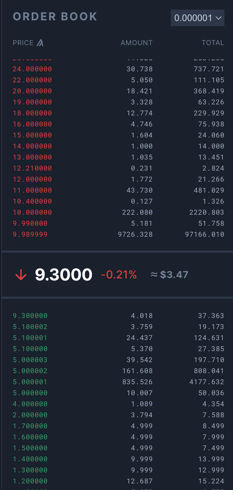

# What is an Orderbook? [WIP]

### Description
An orderbook is the list of all Open Buy and Sell orders for a given asset. 

The orders that comprise the orderbook were submitted as [Maker]{@tutorial Maker} orders. 
They remain in the orderbook until someone agrees to the conditions of the Order and "takes" it, removing it from the orderbook.

**Spread** is the difference between the highest buy price and the lowest sell price of a given asset. 

